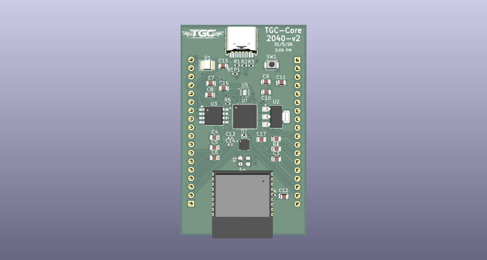

# TGC-Core-Pico-v2

## Overview
The **TGC-Core-Pico-v2** is an open-source, IoT-ready hardware development board designed around the Pico architecture (e.g., RP2040). Engineered for high performance, modern connectivity, and sensor integration, this board combines wireless communication, motion tracking, and robust power delivery into a compact form factor.

This repository contains the complete set of KiCad EDA files (version 10.0) necessary to view, modify, and manufacture the printed circuit board (PCB).

---

## Key Hardware Features

Based on the schematic and board layout, this board includes the following integrated components and capabilities:

* **Microcontroller:** Pico-compatible architecture featuring a built-in **Temperature Sensor** for internal environmental monitoring.
* **Wireless Connectivity:** Integrated **Wi-Fi** (802.11n) and **Bluetooth** (Classic & BLE), making it perfectly suited for IoT nodes, remote telemetry, and wireless control.
* **Modern Interface:** Upgraded with a **USB Type-C** connector for reliable data transfer and power delivery.
* **Onboard Motion Tracking:** Integrated **ICM-20602** 6-axis MEMS motion tracking device (accelerometer and gyroscope) for robotics, drones, or motion-sensitive applications.
* **Power Regulation:** Onboard **AMS1117-3.3** Low Dropout (LDO) regulator providing a stable 3.3V supply across the board.
* **PCB Specs:** Designed as a 4-layer FR4 board for optimal signal integrity, thermal dissipation, and power routing.

---

## Repository Structure

The project is entirely self-contained within the following native KiCad design files:

| File Name | Description |
| :--- | :--- |
| `TGC-Core-Pico-v2.kicad_pro` | The main **KiCad Project file**. Open this file to load the entire workspace. |
| `TGC-Core-Pico-v2.kicad_sch` | The **Schematic file**. Contains the logical connections, USB-C wiring, wireless modules, regulator, and IMU configuration. |
| `TGC-Core-Pico-v2.kicad_pcb` | The **PCB Layout file**. Contains the physical 4-layer board routing, copper pours, and silkscreen definitions. |
| `image_78bedf.png` | A visual render of the top board design. |

---

## Getting Started

### 1. Viewing and Editing the Hardware
To view or modify the hardware design:
1. Download and install [KiCad EDA](https://www.kicad.org/) (Ensure you are using a modern version compatible with KiCad v10 files).
2. Open the `TGC-Core-Pico-v2.kicad_pro` file.
3. Use the Schematic Editor to view component wiring or the PCB Editor to inspect the board stackup, wireless antenna keep-outs, and routing.

### 2. Manufacturing
You can generate standard manufacturing files (Gerbers, Drill files, BOM, and CPL/Pos files for PCBA) directly from the `TGC-Core-Pico-v2.kicad_pcb` file using KiCad's fabrication output tools.

---

## License

This hardware design and its accompanying documentation are licensed under the **Creative Commons Attribution 4.0 International (CC BY 4.0)** Public License.

**You are free to:**
* **Share** — copy and redistribute the material in any medium or format.
* **Adapt** — remix, transform, and build upon the material for any purpose, even commercially.

**Under the following terms:**
* **Attribution** — You must give appropriate credit, provide a link to the license, and indicate if changes were made. You may do so in any reasonable manner, but not in any way that suggests the licensor endorses you or your use.

For the full legal text, please visit the [Creative Commons Website](https://creativecommons.org/licenses/by/4.0/).
